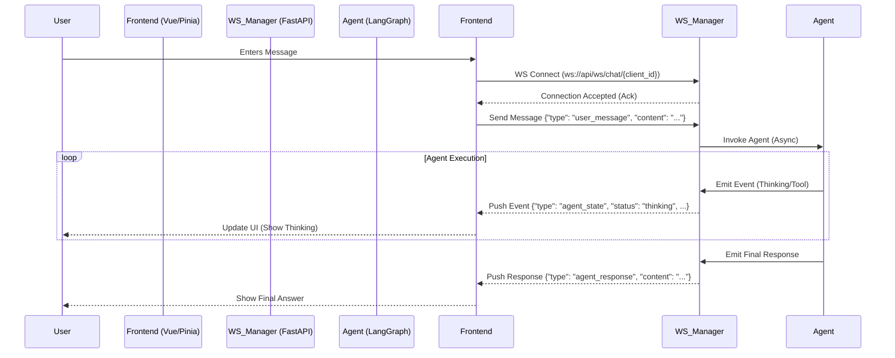

# Comprehensive Technical Plan: Real-Time Bidirectional Chat with WebSockets

## 1. Executive Summary

This document outlines the technical strategy to transition the NaviBot frontend-backend communication from a synchronous HTTP Request/Response model to a real-time, bidirectional WebSocket architecture.

**Primary Objectives:**
*   **Eliminate Timeout Errors:** Decouple long-running agent processes from HTTP request timeouts.
*   **Real-Time Visualization:** Enable granular streaming of Agent "Thinking" processes, tool executions, and intermediate state updates.
*   **Bidirectional Interactivity:** Allow the user to interrupt generation or provide input during execution (future-proofing).
*   **Robustness:** Improve connection stability with automatic reconnection and state recovery.

## 2. Architecture Overview

### 2.1 Current Limitations (HTTP/Polling)
*   **Architecture:** Frontend sends `POST /api/chat`. Backend invokes Agent. Agent runs to completion. Backend returns JSON.
*   **Issues:**
    *   **Timeouts:** Browsers/Proxies (e.g., Nginx, Vercel) often have 60s hard timeouts. Agent tasks often exceed this.
    *   **Opaque Execution:** User sees a spinner until the *entire* response is ready. No visibility into tool usage or "thinking" steps in real-time.
    *   **Statelessness:** Hard to maintain a persistent connection context.

### 2.2 Proposed Architecture (WebSocket)
*   **Architecture:** Frontend establishes a persistent WebSocket connection (`ws://`). Messages are exchanged asynchronously.
*   **Benefits:**
    *   **No Timeouts:** Connection remains open; keep-alive pings prevent idle disconnects.
    *   **Streaming:** Agent pushes events (token, log, tool_start, tool_end) as they happen.
    *   **State Sync:** Server pushes full state updates to the client.

### 2.3 System Diagram



## 3. WebSocket Protocol Specification

### 3.1 Connection
*   **URL:** `ws://<host>/api/ws/chat/{client_id}`
*   **Query Params:** `?token=<auth_token>` (for authentication)

### 3.2 Message Structure
All messages are JSON objects with a `type` field.

#### Client -> Server (Upstream)

1.  **User Message:**
    ```json
    {
      "type": "chat.message",
      "id": "uuid-v4",
      "content": "Analyze this data...",
      "timestamp": 1678900000
    }
    ```

2.  **Ping (Heartbeat):**
    ```json
    { "type": "ping" }
    ```

3.  **Stop Generation:**
    ```json
    { "type": "chat.stop" }
    ```

#### Server -> Client (Downstream)

1.  **Connection Acknowledgment:**
    ```json
    {
      "type": "connection.ack",
      "client_id": "...",
      "status": "connected"
    }
    ```

2.  **Agent State Update (Thinking/Tool):**
    ```json
    {
      "type": "agent.state",
      "state": "thinking", // or "tool_executing"
      "details": {
        "tool_name": "google_search",
        "input": "current weather in Tokyo"
      }
    }
    ```

3.  **Stream Chunk (Token):**
    ```json
    {
      "type": "agent.token",
      "content": "The",
      "index": 0
    }
    ```

4.  **Tool Output:**
    ```json
    {
      "type": "agent.tool_output",
      "tool": "google_search",
      "output": "Sunny, 15°C"
    }
    ```

5.  **Final Response:**
    ```json
    {
      "type": "agent.response",
      "content": "The current weather in Tokyo is Sunny, 15°C.",
      "done": true
    }
    ```

6.  **Error:**
    ```json
    {
      "type": "error",
      "code": "timeout_error",
      "message": "Agent execution timed out."
    }
    ```

7.  **Pong:**
    ```json
    { "type": "pong" }
    ```

## 4. Implementation Strategy

### 4.1 Backend (FastAPI)

1.  **Connection Manager (`app/core/ws_manager.py`):**
    *   Manage active `WebSocket` connections.
    *   Map `client_id` to `WebSocket` objects.
    *   Handle `connect`, `disconnect`, `broadcast`, and `send_personal_message`.

2.  **WebSocket Endpoint (`app/api/chat_ws.py`):**
    *   Route: `/api/ws/chat/{client_id}`.
    *   Authenticate user/session.
    *   Loop: Receive JSON -> Dispatch to Agent -> Await Stream -> Send JSON.

3.  **Agent Modifications (`app/core/agent.py`):**
    *   Update `NaviBot` to support an `astream` generator or callback mechanism that yields intermediate steps (LangChain `astream_events` API is recommended).
    *   Ensure thread-safety for async execution.

### 4.2 Frontend (Vue/Pinia)

1.  **WebSocket Client (`src/services/websocket.ts`):**
    *   Singleton class managing the `WebSocket` instance.
    *   Methods: `connect()`, `disconnect()`, `send()`, `on(event, callback)`.
    *   **Reconnection Logic:**
        *   Exponential backoff: Retry after 1s, 2s, 4s, 8s (max 30s).
        *   Queue messages while disconnected; flush upon reconnection.

2.  **Chat Store (`src/stores/chat.ts`):**
    *   Replace HTTP `fetch` in `sendMessage` with `ws.send()`.
    *   Subscribe to WS events to update `messages` array and `currentThought` state.

## 5. Reliability & Error Handling

### 5.1 Connection Stability
*   **Heartbeat:** Client sends `ping` every 30s. Server responds `pong`. If no `pong` within 10s, Client reconnects.
*   **Graceful Degradation:** If WebSocket fails repeatedly (e.g., corporate firewall), UI should show a connection error (Implementation of HTTP fallback is complex and out of scope for V1, but error messaging is critical).

### 5.2 Message Queueing
*   **Client-Side:** If socket is `CONNECTING` or `CLOSED`, user messages are queued in memory.
*   **Server-Side:** Not required for V1 (Agent is strictly reactive).

### 5.3 Error Scenarios
*   **Network Interruption:** Client detects `close` event -> Triggers Reconnection -> Resubscribes.
*   **Server Crash:** Client detects connection loss -> Reconnects -> Server validates session.

## 6. Security Considerations

*   **Authentication:**
    *   Pass JWT or Session Token in Query Parameter (`wss://...?token=xyz`) or initial handshake message (since WS headers are limited in browser JS).
    *   Validate token on `connect`. Close with 4001 (Unauthorized) if invalid.
*   **Input Validation:**
    *   Validate all incoming JSON schemas using Pydantic models.
*   **Rate Limiting:**
    *   Apply standard rate limits to WS message frames (e.g., max 10 messages/minute per user).

## 7. Performance Benchmarks & Success Metrics

### 7.1 Metrics
*   **Latency:** Time from User Send to First Token < 1s.
*   **Stability:** 99.9% connection uptime during active sessions.
*   **Error Rate:** < 1% of sessions experiencing unexpected disconnects.

### 7.2 Testing Strategy
1.  **Unit Tests:** Test `ConnectionManager` logic (add/remove/broadcast).
2.  **Integration Tests:** Use `TestClient` with `websocket_connect` to simulate chat flows.
3.  **Load Tests:** Simulate 50 concurrent WS connections using `locust` or `k6` to verify async loop performance.
4.  **Edge Cases:**
    *   Disconnect WiFi during generation.
    *   Close browser tab while streaming.
    *   Send malformed JSON.

## 8. Migration Steps

1.  **Phase 1: Backend Infrastructure** [COMPLETED]
    *   Implement `ConnectionManager`.
    *   Create WS endpoint.
    *   Update Agent to expose streaming generator.
2.  **Phase 2: Frontend Integration** [COMPLETED]
    *   Implement `WebSocketService`.
    *   Update `ChatStore`.
    *   Add UI indicators for "Connecting...", "Online", "Offline".
3.  **Phase 3: Rollout & Cleanup** [COMPLETED]
    *   Deploy alongside HTTP API.
    *   Verify stability.
    *   Deprecate HTTP `POST /chat` for message sending (keep for history fetching).

## 9. Verification

- [x] Backend WebSocket Server is running and accepting connections.
- [x] Agent streaming logic is working (tokens + tools).
- [x] Frontend `WebSocketService` connects and handles reconnection.
- [x] Chat interface displays real-time tokens and tool logs.
- [x] Integration test `backend/tests/integration_ws.py` passed.

